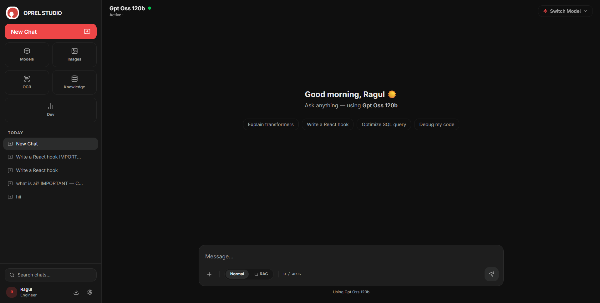
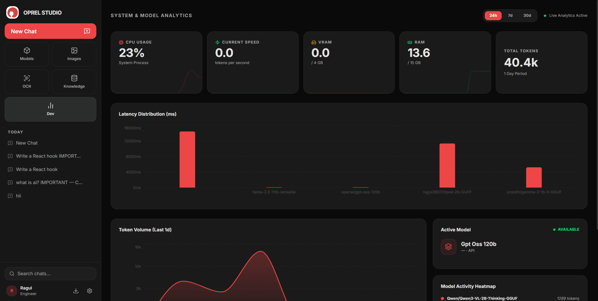
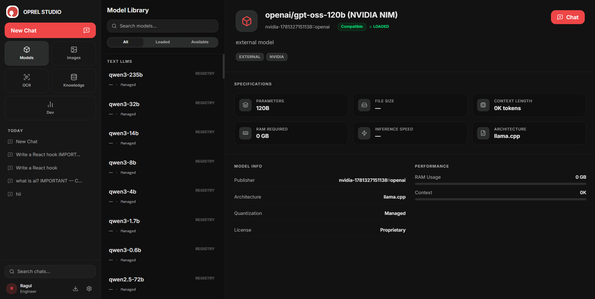
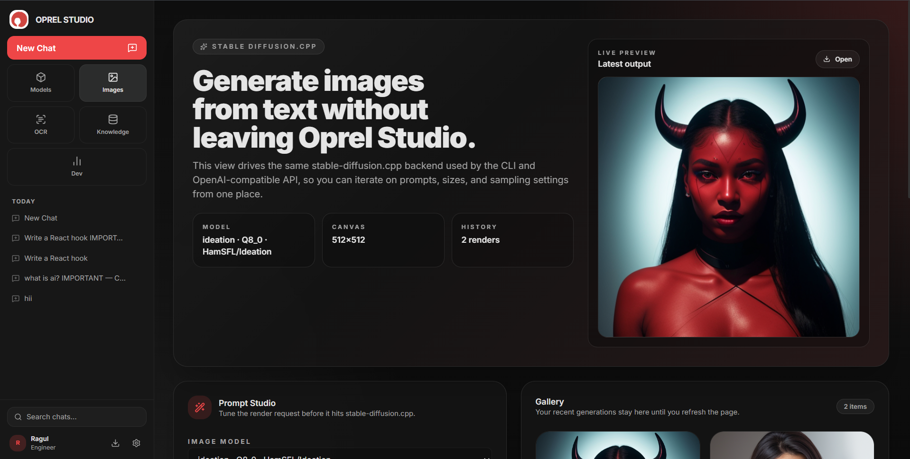
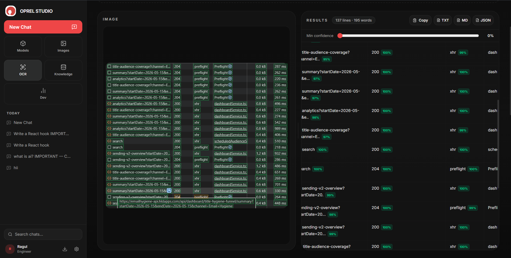
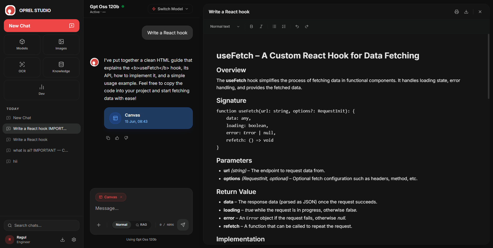
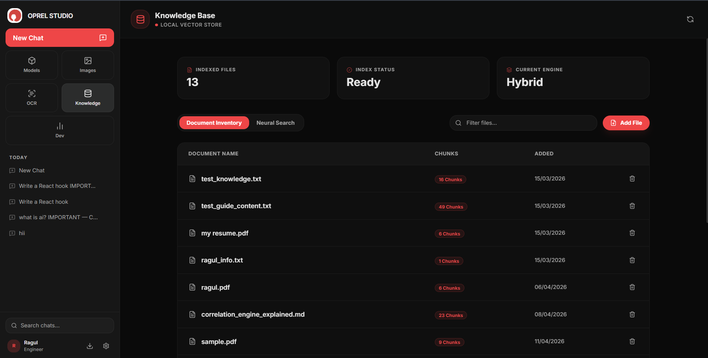
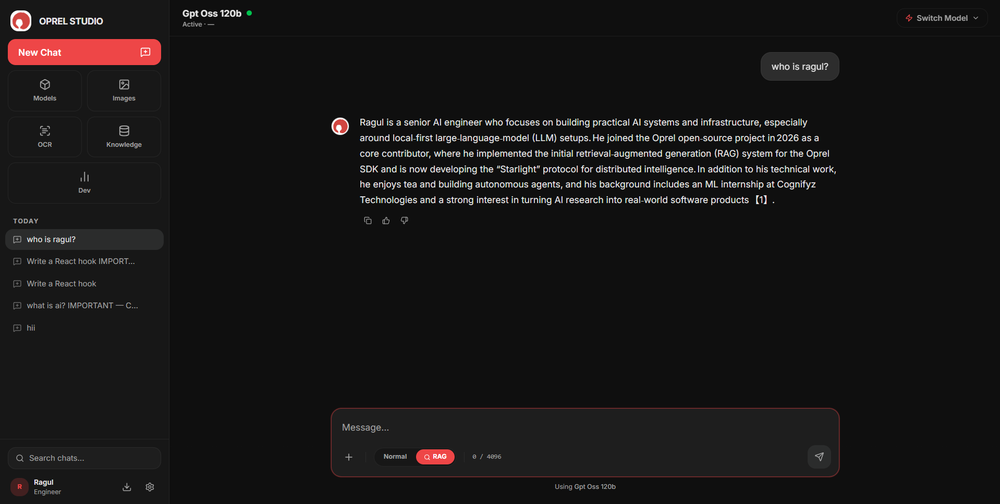
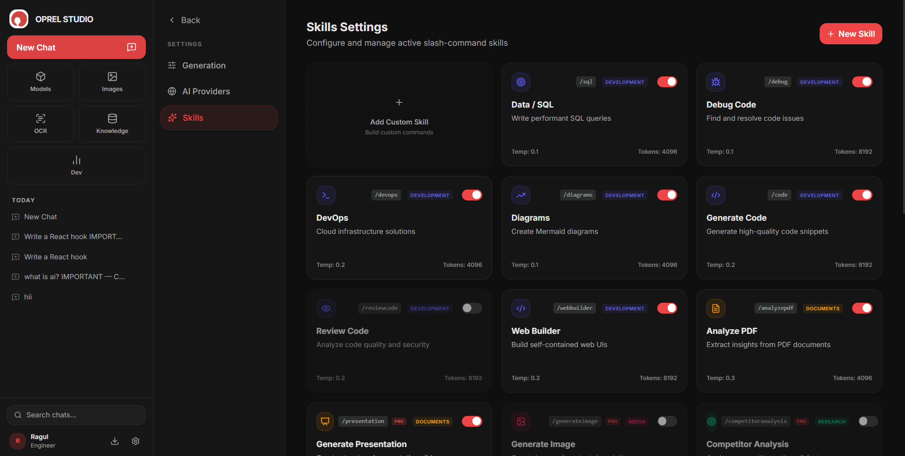
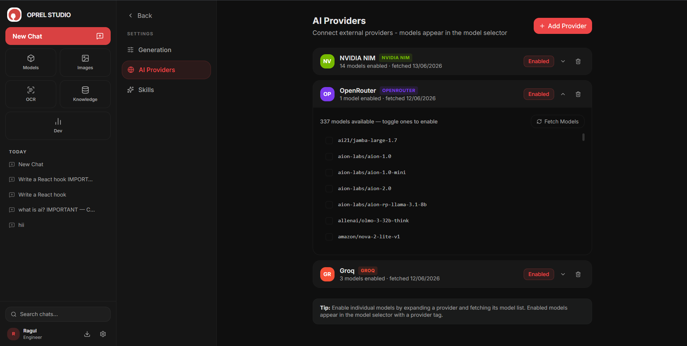

# OPREL — Complete Usage Guide

Run Large Language Models Locally - With Studio, API & Cloud Integration  
**Version 0.6.1**

Oprel is a high-performance Python library and local AI platform for running large language models (LLMs) and multimodal AI entirely on your own hardware. It provides a curated model registry, a beautiful web UI (Oprel Studio), a developer API, image generation, RAG-powered knowledge base, and support for external cloud providers — all in one tool.

Install: `pip install oprel==0.6.2` | PyPI: https://pypi.org/project/oprel/0.6.2/

---

## 1. Getting Started

### Installation
Oprel requires Python 3.9+ and is distributed via PyPI. Install it with:

```bash
pip install oprel==0.6.2
```

### Launching Oprel Studio (Web UI)
Oprel Studio is the built-in browser interface for chatting with models, managing your knowledge base, generating images, and monitoring system performance. Start it with a single command:

```bash
oprel start
```

This opens Oprel Studio in your browser automatically. The interface greets you with a personalised welcome, quick-action prompts, and a model selector in the top bar.



### Studio Navigation
- **Models** — browse, download, and switch between local models
- **Images** — generate images from text using `stable-diffusion.cpp`
- **OCR** — extract text from images and documents using `PaddleOCR`
- **Canvas** — view interactive Mermaid diagrams and HTML previews side-by-side with chat
- **Dev** — system analytics and developer API metrics
- **Knowledge** — RAG document store with hybrid search

---

## 2. Command-Line Interface (CLI)

### Running a Model
Oprel can download and run any model from its registry with a single command. Two modes are available:

#### Single-shot mode — load, respond, unload
Pass a prompt directly. The model loads, answers your question, and immediately unloads.
```bash
oprel run gemma3-1b "Explain recursion in one sentence"
```

#### Interactive chat mode — continuous conversation
Omit the prompt to enter an interactive session. The model stays loaded between turns for fast, multi-turn conversations.
```bash
oprel run gemma3-1b
```

### Server Mode (Persistent Caching)
Start the background server once to keep models warm in memory. Subsequent `oprel run` calls respond almost instantly without the cold-start cost.

```bash
# Start persistent server
oprel serve

# Now all run commands are instant
oprel run gemma3-1b "Hello"
```

### Vision Models
Multimodal models that accept images can be invoked with the `vision` sub-command. Pass one or more image files with the `--images` flag.

```bash
oprel vision qwen3-vl-7b "What's in this image?" --images photo.jpg
```

### Image Generation (CLI)
Oprel exposes `stable-diffusion.cpp` image generation from the CLI as well as from the Studio UI. Use the `gen` command to create images from a text prompt.

```bash
oprel gen "A futuristic city skyline at sunset, cinematic lighting"
```

---

## 3. Python API

Oprel ships a lightweight Python API for programmatic access to any locally running model. Import the `Model` class and call `generate()` for one-shot completions.

```python
from oprel import Model

# Auto-optimized loading — Oprel picks the best quantization
model = Model("gemma3-1b")

response = model.generate("Write a binary search in Python")
print(response)
```

### Developer API — OpenAI-Compatible Endpoints
When the server is running (`oprel serve`), Oprel exposes OpenAI-compatible chat completion endpoints — the same interface used by tools like VS Code Copilot, Open WebUI, and custom apps. Point any OpenAI SDK client at your local server:

```python
import openai

client = openai.OpenAI(
    base_url="http://localhost:11435/v1",
    api_key="oprel"  # any string
)

response = client.chat.completions.create(
    model="gemma3-1b",
    messages=[{"role": "user", "content": "Hello!"}]
)
print(response.choices[0].message.content)
```

### Dev Analytics Dashboard
The **Dev** tab in Oprel Studio provides real-time system and model analytics, including CPU usage, VRAM, RAM, inference speed in tokens per second, latency distribution across models, and a rolling token volume chart.



---

## 4. Model Library

The **Models** tab in Oprel Studio is a curated visual registry of all available and downloaded models. It functions similarly to Ollama's pull system but with a richer UI showing quantization options, memory requirements, and live status.



### Key Features
- **One-Click Deployment** — pull any model without touching the terminal
- **Quantization Intelligence** — see `Q4_K`, `Q8_0` quants and their RAM footprint before downloading
- **Smart Status** — real-time indicators for which model is currently loaded
- **Filter tabs**: All / Loaded / Available
- **Coding Specialists** — dedicated section for code models (`qwen-coder`, `phi`, etc.)

### Downloading a Model
Select any model in the registry and click the **Download** button in the top-right corner. Choose the quantization level that fits your hardware before downloading.

```bash
# Equivalent CLI download
oprel pull qwen2.5-coder-1.5b
```

---

## 5. Image Generation

Oprel integrates `stable-diffusion.cpp` as its image generation backend — the same engine used by its CLI and OpenAI-compatible API. The **Images** tab in Oprel Studio lets you iterate on prompts, canvas sizes, and sampling settings without leaving the browser.



### Getting Started with Images
Navigate to the **Images** tab. The current model, canvas size, and render count are displayed at the top. Scroll down to the **Prompt Studio** panel to configure your generation:
- **Image Model** — select from your downloaded Stable Diffusion models
- **Canvas** — set output resolution (default `512×512`)
- **Prompt** — describe what you want to generate
- **Negative prompt** — specify what to exclude
- **Sampling settings** — steps, CFG scale, seed

### Gallery
All renders produced in a session are saved in the **Gallery** panel on the right. They persist until you refresh the page.

```bash
# CLI equivalent
oprel gen "A serene mountain landscape, Studio Ghibli style"
```

---

## 6. OCR (Optical Character Recognition)

Oprel incorporates a built-in Optical Character Recognition (OCR) pipeline powered by PaddleOCR. It runs entirely locally, allowing you to extract text from images, screenshots, invoices, and documents with high accuracy.



### Key Features
- **Bounding Box Overlay** — visual highlights matching the precise locations of extracted text lines on your uploaded image.
- **Confidence Scoring** — color-coded badges indicating OCR extraction confidence (e.g. green for high, amber for moderate, red for low).
- **Table Detection** — automatically groups matching text bands into structured HTML tables for receipt and table scanning.
- **Multi-Format Export** — export the full extracted text to Plain Text (`.txt`), Markdown (`.md`), or raw JSON (`.json`) with coordinates.
- **Persistent History** — keep a history of all recent extractions locally to view, search, or delete them anytime.
- **Fixed-Height Split View** — a side-by-side workspace with a fixed height of `720px` that preserves image aspect ratio and aligns text bboxes perfectly while allowing horizontal resizing.

### One-Time Setup
On your first use, Oprel Studio will prompt you to download the PaddleOCR models (~30MB). Click the **Download OCR Models** button to install the required packages and models automatically in the background.

---

## 7. Artifacts Canvas

Oprel Studio features a dual-panel workspace called the **Artifacts Canvas**. When you ask a model to write code, generate diagrams, or design web elements, it renders them in real time in a dedicated interactive side panel next to the chat.



### Key Features
- **Code & Preview Split** — view code outputs side-by-side with their rendered formats.
- **Interactive Prototyping** — test rendered HTML, CSS, and Tailwind CSS previews in real-time.
- **Flowcharts & Diagrams** — automatically detects and compiles Mermaid syntax into clean SVG/Mermaid flowcharts, sequence diagrams, and class diagrams.
- **Expandable Panels** — adjust panel sizes or expand the canvas to full screen for detailed inspection.

---

## 8. Knowledge Base & RAG

Oprel includes a built-in Retrieval-Augmented Generation (RAG) system backed by a local vector store. Upload documents once and reference them in any chat conversation by toggling the **RAG** button in the message input.



### Adding Documents
Open the **Knowledge** tab and click **Add File** to index a new document. Supported formats include PDF, TXT, and Markdown. Each file is split into chunks and embedded automatically.
- **Index Status** shows `Ready` when all documents are processed.
- **Current Engine**: `Hybrid` — combines dense vector search with keyword matching for best recall.
- **Chunks** column shows how many segments each document was split into.

### Using RAG in Chat
With documents indexed, switch to the **Chat** tab and enable the **RAG** toggle in the message input bar (next to the Normal mode selector). Your question will be answered using content retrieved from your knowledge base.



> [!TIP]
> Toggle RAG on only when your question requires document context. For general questions, leave RAG off to avoid irrelevant retrieval noise.

### Neural Search
Switch to the **Neural Search** tab within **Knowledge** to run semantic queries directly against your vector store without triggering a full LLM response. Useful for quickly locating relevant chunks before a RAG-backed conversation.

---

## 9. Skills (Slash Commands)

Skills are pre-configured prompt templates accessible via slash commands (`/`). They package a system prompt, temperature, and token budget into a reusable command so you can invoke expert modes instantly during any chat.



### Built-in Skills
Oprel ships with a curated set of skills across four categories:

1. **Development**
   - **Debug Code (`/debug`)** — find and resolve code issues (Temp: 0.1)
   - **Generate Code (`/generate`)** — generate high-quality code snippets (Temp: 0.2)
   - **Review Code (`/review`)** — analyse code quality and security (Temp: 0.2)
2. **Documents**
   - **Analyze PDF (`/analyze`)** — extract insights from PDF documents
   - **Generate Presentation (`/presentation`)** — create structured slides
3. **Research**
   - **Competitor Analysis** — analyse competitor options and features
   - **Deep Research** — comprehensive multi-step research
   - **Web Search** — real-time web-assisted answers
4. **Writing**
   - **Explain** — break down complex topics clearly
   - **Rewrite** — improve clarity and tone of existing text

### Enabling & Disabling Skills
Toggle any skill on or off using the switch on its card in **Settings > Skills**. Enabled skills appear as slash commands in the chat input.

### Creating Custom Skills
Click **+ New Skill** to build your own slash command. Provide a name, trigger word, system prompt, temperature, and max token budget. Custom skills appear alongside built-ins in the chat input.

---

## 10. External AI Providers

Oprel is not limited to local models. The **AI Providers** settings panel lets you connect cloud inference services so their models appear alongside your local ones in the model selector — giving you one unified interface for local and cloud AI.



### Supported Providers
- **Google Gemini** — Gemini 2.0 Flash/Pro with free-tier quota
- **NVIDIA NIM** — high-performance inference on NVIDIA accelerated cloud
- **Groq** — record-breaking speeds via LPU technology
- **OpenRouter** — access 200+ models from a single API key
- **Custom OpenAI** — connect any OpenAI-compatible internal or third-party server

### Adding a Provider
Go to **Settings > AI Providers** and click **+ Add Provider**. Select the provider type, enter your API key, and click **Fetch Models**. Enable individual models by toggling them in the expanded provider view. Enabled models appear in the model selector with a provider badge.

> [!TIP]
> Use **Fetch Models** after adding a provider to pull the latest available model list. The fetch date is displayed next to each provider entry.

### Enabling Specific Models
Expand a provider row to see all available models. Toggle the checkboxes next to the models you want active. Models marked **ACTIVE** are currently in use. Example: in the Groq provider, `groq/compound` and `llama-3.3-70b-versatile` are enabled as active models.

---

## 11. Quick Reference

### CLI Commands

```bash
# Run model — interactive mode
oprel run <model-name>

# Run model — single prompt (load → respond → unload)
oprel run <model-name> "your prompt"

# Start persistent server (speeds up subsequent calls)
oprel serve

# Vision/multimodal inference
oprel vision <model-name> "prompt" --images image.jpg

# Generate an image
oprel gen "your image prompt"

# Launch Oprel Studio web UI
oprel start

# Download a model
oprel pull <model-name>
```

### Python API

```python
from oprel import Model

model = Model("gemma3-1b")
print(model.generate("Your prompt"))
```

### Feature Summary

| Feature | Details |
|---|---|
| **CLI** | `oprel run`, `oprel serve`, `oprel vision`, `oprel gen`, `oprel start` |
| **Python API** | `from oprel import Model` — simple `generate()` interface |
| **Developer API** | OpenAI-compatible REST endpoint for any chat client |
| **Oprel Studio** | Full-featured browser UI at `localhost:11435` |
| **Model Registry** | Curated LLMs with quantization selection and RAM preview |
| **Image Generation** | `stable-diffusion.cpp` backend, Prompt Studio, gallery |
| **OCR** | Local PaddleOCR extraction, bounding box overlays, table detection, TXT/MD/JSON export |
| **Canvas** | Dual-panel workspace rendering Mermaid diagrams and HTML/Tailwind CSS previews |
| **Knowledge Base** | Local vector store, hybrid RAG, neural search |
| **Skills** | Slash-command templates for code, research, writing |
| **Cloud Providers** | Gemini, NVIDIA NIM, Groq, OpenRouter, Custom OpenAI |
| **Analytics** | Live TPS, VRAM/RAM, CPU, latency, token volume charts |

---

*Oprel — Run AI Locally, Your Way*  
[PyPI Page](https://pypi.org/project/oprel/0.6.1/)
